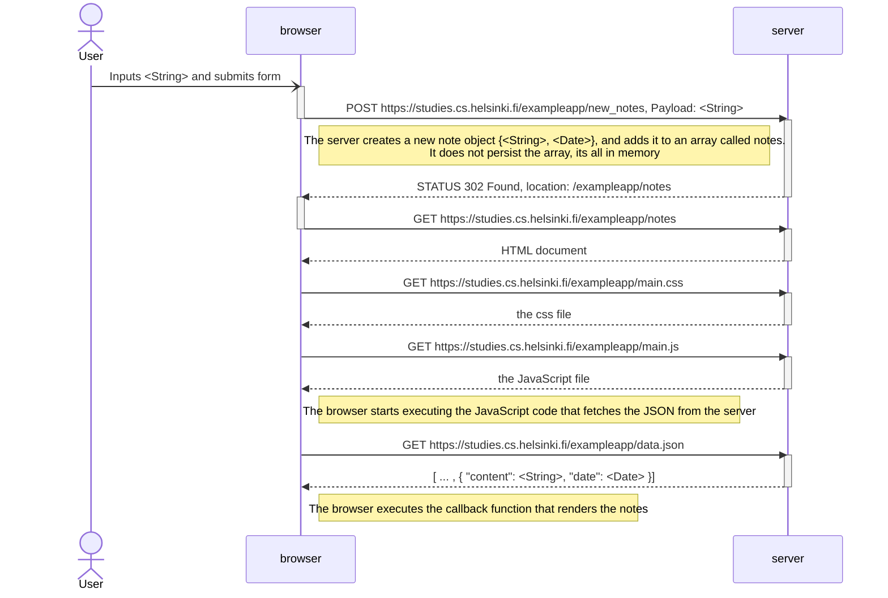

```mermaid
sequenceDiagram
    actor User
    participant browser
    participant server

    User-)browser: Inputs <String> and submits form
    activate browser
    browser->>server: POST https://studies.cs.helsinki.fi/exampleapp/new_notes, Payload: <String>
    deactivate browser
    activate server
    Note left of server: The server creates a new note object {<String>, <Date>}, and adds it to an array called notes.<br/>It does not persist the array, its all in memory
    server-->>browser: STATUS 302 Found, location: /exampleapp/notes
    deactivate server

    activate browser
    browser->>server: GET https://studies.cs.helsinki.fi/exampleapp/notes
    deactivate browser
    activate server
    server-->>browser: HTML document
    deactivate server

    browser->>server: GET https://studies.cs.helsinki.fi/exampleapp/main.css
    activate server
    server-->>browser: the css file
    deactivate server

    browser->>server: GET https://studies.cs.helsinki.fi/exampleapp/main.js
    activate server
    server-->>browser: the JavaScript file
    deactivate server

    Note right of browser: The browser starts executing the JavaScript code that fetches the JSON from the server

    browser->>server: GET https://studies.cs.helsinki.fi/exampleapp/data.json
    activate server
    server-->>browser: [ ... , { "content": <String>, "date": <Date> }]
    deactivate server

    Note right of browser: The browser executes the callback function that renders the notes
```

