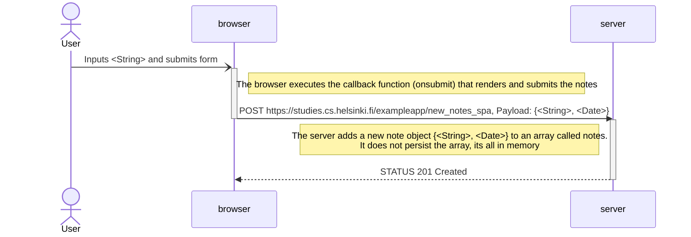

```mermaid
sequenceDiagram
    actor User
    participant browser
    participant server

    User-)+browser: Inputs <String> and submits form

    Note right of browser: The browser executes the callback function (onsubmit) that renders and submits the notes
    browser->>-server: POST https://studies.cs.helsinki.fi/exampleapp/new_notes_spa, Payload: {<String>, <Date>}

    activate server
    Note left of server: The server adds a new note object {<String>, <Date>} to an array called notes.<br/>It does not persist the array, its all in memory
    server-->>browser: STATUS 201 Created
    deactivate server

```

